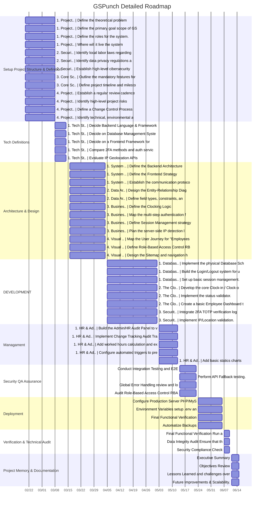

# GSPunch Roadmap

```mermaid
gantt
    title GSPunch Detailed Roadmap
    dateFormat YYYY-MM-DD
    axisFormat %m/%d
    section Setup Project Structure & Definition
    1. Project.. | Define the theoretical problem : 2026-02-20, 2026-03-08
    1. Project.. | Define the primary goal scope of GS : 2026-02-20, 2026-03-08
    1. Project.. | Define the roles for the system. : 2026-02-20, 2026-03-08
    1. Project.. | Where will it live the system : 2026-02-20, 2026-03-08
    2.  Securi.. | Identify local labor laws regarding : 2026-02-20, 2026-03-08
    2.  Securi.. | Identify data privacy regulations a : 2026-02-20, 2026-03-08
    2.  Securi.. | Establish high-level cibersecurity : 2026-02-20, 2026-03-08
    3. Core Sc.. | Outline the mandatory features for : 2026-02-20, 2026-03-08
    3. Core Sc.. | Define project timeline and milesto : 2026-02-20, 2026-03-08
    4. Project.. | Establish a regular review cadence : 2026-02-20, 2026-03-08
    4. Project.. | Identify high-level project risks : 2026-02-20, 2026-03-08
    4. Project.. | Define a Change Control Process : 2026-02-20, 2026-03-08
    4. Project.. | Identify technical, environmental a : 2026-02-20, 2026-03-08
    section Tech Definitions
    1. Tech St.. | Decide Backend Language & Framework : 2026-03-08, 2026-03-14
    1. Tech St.. | Decide on Database Management Syste : 2026-03-08, 2026-03-14
    1. Tech St.. | Decide on a Frontend Framework for : 2026-03-08, 2026-03-14
    1. Tech St.. | Compare 2FA methods and auth servic : 2026-03-08, 2026-03-14
    1. Tech St.. | Evaluate IP Geolocation APIs : 2026-03-08, 2026-03-14
    section Architecture & Design
    1. System .. | Define the Backend Architecture : 2026-03-16, 2026-04-04
    1. System .. | Define the Frontend Strategy : 2026-03-16, 2026-04-04
    1. System .. | Establish the communication protoco : 2026-03-16, 2026-04-04
    2. Data Ar.. | Design the Entity-Relationship Diag : 2026-03-16, 2026-04-04
    2. Data Ar.. | Define field types, constraints, an : 2026-03-16, 2026-04-04
    3. Busines.. | Define the Clocking Logic : 2026-03-16, 2026-04-04
    3. Busines.. | Map the multi-step authentication f : 2026-03-16, 2026-04-04
    3. Busines.. | Define Session Management strategy : 2026-03-16, 2026-04-04
    3. Busines.. | Plan the server-side IP detection l : 2026-03-16, 2026-04-04
    4. Visual .. | Map the User Journey for "Employees : 2026-03-16, 2026-04-04
    4. Visual .. | Define Role-Based Access Control RB : 2026-03-16, 2026-04-04
    4. Visual .. | Design the Sitemap and navigation h : 2026-03-16, 2026-04-04
    section DEVELOPMENT
    1. Databas.. | Implement the physical Database Sch : 2026-04-05, 2026-05-02
    1. Databas.. | Build the Login/Logout system for u : 2026-04-05, 2026-05-02
    1. Databas.. | Set up basic session management. : 2026-04-05, 2026-05-02
    2. The Clo.. | Develop the core Clock-in / Clock-o : 2026-04-05, 2026-05-02
    2. The Clo.. | Implement the status validator. : 2026-04-05, 2026-05-02
    2. The Clo.. | Create a basic Employee Dashboard t : 2026-04-05, 2026-05-02
    3. Securit.. | Integrate 2FA TOTP verification log : 2026-04-05, 2026-05-02
    3. Securit.. | Implement IP/Location validation. : 2026-04-05, 2026-05-02
    section Managament
    1. HR & Ad.. | Build the Admin/HR Audit Panel to v : 2026-05-03, 2026-05-13
    1. HR & Ad.. | Implement Change Tracking Audit Tra : 2026-05-03, 2026-05-13
    1. HR & Ad.. | Add worked hours calculation and ex : 2026-05-03, 2026-05-13
    1. HR & Ad.. | Configure automated triggers to pre : 2026-05-03, 2026-05-13
    1. HR & Ad.. | Add basic statics charts : 2026-05-03, 2026-05-13
    section Security QA Assurance
    Conduct Integration Testing and E2E : 2026-05-14, 2026-05-23
    Perform API Fallback testing. : 2026-05-14, 2026-05-23
    Global Error Handling review and lo : 2026-05-14, 2026-05-23
    Audit Role-Based Access Control RBA : 2026-05-14, 2026-05-23
    section Deployment
    Configure Production Server PHP/MyS : 2026-05-24, 2026-06-06
    Environment Variables setup .env an : 2026-05-24, 2026-06-06
    Final Functional Verification : 2026-05-24, 2026-06-06
    Automatize Backups : 2026-05-24, 2026-06-06
    section Verification & Technical Audit
    Final Functional Verification Run a : 2026-06-07, 2026-06-10
    Data Integrity Audit Ensure that th : 2026-06-07, 2026-06-10
    Security Compliance Check : 2026-06-07, 2026-06-10
    section Project Memory & Documentation
    Executive Summary : 2026-06-11, 2026-06-15
    Objectives Review : 2026-06-11, 2026-06-15
    Lessons Learned and challenges over : 2026-06-11, 2026-06-15
    Future Improvements & Scalability. : 2026-06-11, 2026-06-15
```