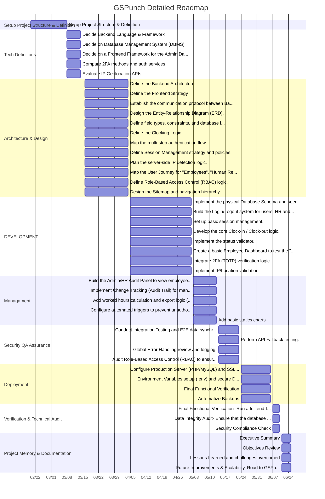

# GSPunch Roadmap

```mermaid
gantt
    title GSPunch Detailed Roadmap
    dateFormat YYYY-MM-DD
    axisFormat %m/%d
    section Setup Project Structure & Definition
    Setup Project Structure & Definition : 2026-02-20, 2026-03-08
    section Tech Definitions
    Decide Backend Language & Framework : 2026-03-08, 2026-03-14
    Decide on Database Management System (DBMS) : 2026-03-08, 2026-03-14
    Decide on a Frontend Framework for the Admin Da... : 2026-03-08, 2026-03-14
    Compare 2FA methods and auth services : 2026-03-08, 2026-03-14
    Evaluate IP Geolocation APIs : 2026-03-08, 2026-03-14
    section Architecture & Design
    Define the Backend Architecture : 2026-03-16, 2026-04-04
    Define the Frontend Strategy : 2026-03-16, 2026-04-04
    Establish the communication protocol between Ba... : 2026-03-16, 2026-04-04
    Design the Entity-Relationship Diagram (ERD). : 2026-03-16, 2026-04-04
    Define field types, constraints, and database i... : 2026-03-16, 2026-04-04
    Define the Clocking Logic : 2026-03-16, 2026-04-04
    Map the multi-step authentication flow. : 2026-03-16, 2026-04-04
    Define Session Management strategy and policies. : 2026-03-16, 2026-04-04
    Plan the server-side IP detection logic. : 2026-03-16, 2026-04-04
    Map the User Journey for "Employees", "Human Re... : 2026-03-16, 2026-04-04
    Define Role-Based Access Control (RBAC) logic. : 2026-03-16, 2026-04-04
    Design the Sitemap and navigation hierarchy. : 2026-03-16, 2026-04-04
    section DEVELOPMENT
    Implement the physical Database Schema and seed... : 2026-04-05, 2026-05-02
    Build the Login/Logout system for users, HR and... : 2026-04-05, 2026-05-02
    Set up basic session management. : 2026-04-05, 2026-05-02
    Develop the core Clock-in / Clock-out logic. : 2026-04-05, 2026-05-02
    Implement the status validator. : 2026-04-05, 2026-05-02
    Create a basic Employee Dashboard to test the "... : 2026-04-05, 2026-05-02
    Integrate 2FA (TOTP) verification logic. : 2026-04-05, 2026-05-02
    Implement IP/Location validation. : 2026-04-05, 2026-05-02
    section Managament
    Build the Admin/HR Audit Panel to view employee... : 2026-05-03, 2026-05-13
    Implement Change Tracking (Audit Trail) for man... : 2026-05-03, 2026-05-13
    Add worked hours calculation and export logic (... : 2026-05-03, 2026-05-13
    Configure automated triggers to prevent unautho... : 2026-05-03, 2026-05-13
    Add basic statics charts : 2026-05-03, 2026-05-13
    section Security QA Assurance
    Conduct Integration Testing and E2E data synchr... : 2026-05-14, 2026-05-23
    Perform API Fallback testing. : 2026-05-14, 2026-05-23
    Global Error Handling review and logging. : 2026-05-14, 2026-05-23
    Audit Role-Based Access Control (RBAC) to ensur... : 2026-05-14, 2026-05-23
    section Deployment
    Configure Production Server (PHP/MySQL) and SSL... : 2026-05-24, 2026-06-06
    Environment Variables setup (.env) and secure D... : 2026-05-24, 2026-06-06
    Final Functional Verification : 2026-05-24, 2026-06-06
    Automatize Backups : 2026-05-24, 2026-06-06
    section Verification & Technical Audit
    Final Functional Verification- Run a full end-t... : 2026-06-07, 2026-06-10
    Data Integrity Audit- Ensure that the database ... : 2026-06-07, 2026-06-10
    Security Compliance Check : 2026-06-07, 2026-06-10
    section Project Memory & Documentation
    Executive Summary : 2026-06-11, 2026-06-15
    Objectives Review : 2026-06-11, 2026-06-15
    Lessons Learned and challenges overcomed : 2026-06-11, 2026-06-15
    Future Improvements & Scalability. Road to GSPu... : 2026-06-11, 2026-06-15
```